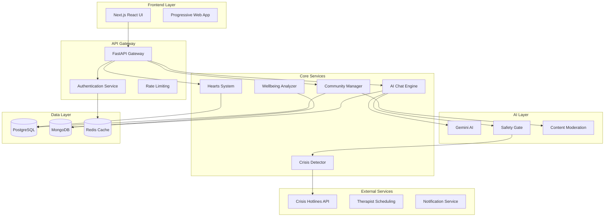

# Design Document: Meghan AI Community Support System

## Overview

Meghan is a comprehensive AI-powered mental health support platform designed for young adults (18-25) experiencing stress, anxiety, and emotional overwhelm. The system combines empathetic AI conversation, peer community support, professional oversight, and gamified positive reinforcement to create a safe, accessible mental health ecosystem.

The platform operates on a privacy-first architecture with multiple layers of safety validation, crisis detection, and professional oversight. The design emphasizes immediate accessibility, emotional validation, and gradual skill-building through various interaction modes and community engagement.

## Architecture

### High-Level Architecture



### Service Architecture Principles

1. **Microservices Design**: Each core component (Chat, Community, Hearts, Crisis Detection) operates as an independent service
2. **Event-Driven Communication**: Services communicate through event streams for loose coupling
3. **Safety-First**: Multiple validation layers prevent harmful content from reaching users
4. **Privacy by Design**: Data minimization and encryption at every layer
5. **Scalable AI**: AI services designed for horizontal scaling with request queuing

## Components and Interfaces

### Profile Manager

**Purpose**: Manages user profiles, privacy settings, and onboarding flow

**Key Interfaces**:
```typescript
interface ProfileManager {
  createProfile(onboardingData: OnboardingData): Promise<UserProfile>
  updatePrivacySettings(userId: string, settings: PrivacySettings): Promise<void>
  getProfile(userId: string): Promise<UserProfile>
  anonymizeProfile(userId: string): Promise<AnonymousProfile>
}

interface OnboardingData {
  ageRange: AgeRange
  lifeStage: LifeStage
  primaryStruggles: Struggle[]
  privacyLevel: PrivacyLevel
}

interface PrivacySettings {
  anonymityLevel: 'full' | 'partial' | 'identified'
  dataSharing: boolean
  communityVisibility: 'public' | 'limited' | 'private'
}
```

### AI Chat Engine

**Purpose**: Provides empathetic conversational AI across four specialized modes

**Key Interfaces**:
```typescript
interface ChatEngine {
  startSession(userId: string, mode: ChatMode): Promise<ChatSession>
  processMessage(sessionId: string, message: string): Promise<ChatResponse>
  endSession(sessionId: string): Promise<SessionSummary>
}

interface ChatResponse {
  message: string
  emotionalTone: EmotionalTone
  suggestedActions: Action[]
  riskLevel: RiskLevel
}

enum ChatMode {
  TALK = 'talk',      // Emotional venting and validation
  PLAN = 'plan',      // Micro-planning and goal setting
  CALM = 'calm',      // Grounding and breathing exercises
  REFLECT = 'reflect' // Structured journaling
}
```

### Community Manager

**Purpose**: Manages problem-based support groups with moderation and safety

**Key Interfaces**:
```typescript
interface CommunityManager {
  joinCommunity(userId: string, communityType: CommunityType): Promise<void>
  createPost(userId: string, communityId: string, content: string): Promise<Post>
  moderateContent(content: string): Promise<ModerationResult>
  getCommunitiesForUser(userId: string): Promise<Community[]>
}

enum CommunityType {
  CAREER = 'career',
  RELATIONSHIPS = 'relationships',
  FAMILY = 'family',
  STUDIES = 'studies'
}

interface Post {
  id: string
  authorId: string
  content: string
  timestamp: Date
  reactions: Reaction[]
  moderationStatus: ModerationStatus
}
```

### Hearts System

**Purpose**: Manages positive reinforcement currency and reward redemption

**Key Interfaces**:
```typescript
interface HeartsSystem {
  awardHearts(userId: string, action: HeartAction, amount: number): Promise<void>
  getBalance(userId: string): Promise<number>
  redeemHearts(userId: string, reward: Reward): Promise<RedemptionResult>
  getAvailableRewards(userId: string): Promise<Reward[]>
}

enum HeartAction {
  JOURNALING = 'journaling',
  HELPING_OTHERS = 'helping_others',
  SELF_CARE_CHECKIN = 'self_care_checkin',
  COMMUNITY_PARTICIPATION = 'community_participation'
}

interface Reward {
  id: string
  name: string
  description: string
  heartsCost: number
  type: 'therapist_session' | 'premium_feature' | 'customization'
}
```

### Crisis Detector

**Purpose**: Identifies mental health emergencies and triggers appropriate interventions

**Key Interfaces**:
```typescript
interface CrisisDetector {
  analyzeContent(content: string, userId: string): Promise<CrisisAssessment>
  escalateCrisis(userId: string, assessment: CrisisAssessment): Promise<void>
  getEmergencyResources(location?: string): Promise<EmergencyResource[]>
}

interface CrisisAssessment {
  riskLevel: 'low' | 'medium' | 'high' | 'critical'
  indicators: CrisisIndicator[]
  recommendedAction: CrisisAction
  confidence: number
}

enum CrisisIndicator {
  SELF_HARM_LANGUAGE = 'self_harm_language',
  SUICIDE_IDEATION = 'suicide_ideation',
  SEVERE_DEPRESSION = 'severe_depression',
  PANIC_ATTACK = 'panic_attack'
}
```

### Wellbeing Analyzer

**Purpose**: Generates weekly insights and tracks emotional progress

**Key Interfaces**:
```typescript
interface WellbeingAnalyzer {
  generateWeeklyInsights(userId: string): Promise<WellbeingInsights>
  trackMoodTrends(userId: string, timeframe: Timeframe): Promise<MoodTrend[]>
  identifyTriggers(userId: string): Promise<TriggerPattern[]>
  compareProgress(userId: string, pastPeriod: Date, currentPeriod: Date): Promise<ProgressComparison>
}

interface WellbeingInsights {
  moodTrends: MoodTrend[]
  triggerPatterns: TriggerPattern[]
  positiveProgress: ProgressIndicator[]
  recommendations: Recommendation[]
  encouragementMessage: string
}
```

## Data Models

### User Profile Model

```typescript
interface UserProfile {
  id: string
  createdAt: Date
  updatedAt: Date
  
  // Onboarding Data
  ageRange: AgeRange
  lifeStage: LifeStage
  primaryStruggles: Struggle[]
  
  // Privacy Settings
  privacySettings: PrivacySettings
  anonymousId?: string
  
  // Platform Engagement
  heartsBalance: number
  communitiesJoined: string[]
  lastActiveAt: Date
  
  // Wellbeing Tracking
  moodHistory: MoodEntry[]
  journalEntries: JournalEntry[]
  progressMilestones: Milestone[]
}
```

### Chat Session Model

```typescript
interface ChatSession {
  id: string
  userId: string
  mode: ChatMode
  startedAt: Date
  endedAt?: Date
  
  messages: ChatMessage[]
  emotionalJourney: EmotionalState[]
  riskAssessments: CrisisAssessment[]
  
  summary?: SessionSummary
  heartsAwarded: number
}

interface ChatMessage {
  id: string
  role: 'user' | 'assistant'
  content: string
  timestamp: Date
  emotionalTone?: EmotionalTone
  riskLevel: RiskLevel
}
```

### Community Model

```typescript
interface Community {
  id: string
  type: CommunityType
  name: string
  description: string
  
  members: CommunityMember[]
  posts: Post[]
  moderators: TherapistMonitor[]
  
  guidelines: string[]
  safetyRules: SafetyRule[]
  
  createdAt: Date
  isActive: boolean
}

interface CommunityMember {
  userId: string
  anonymousId: string
  joinedAt: Date
  participationLevel: ParticipationLevel
  heartsEarned: number
  postsCount: number
  helpfulResponsesCount: number
}
```

### Hearts Transaction Model

```typescript
interface HeartsTransaction {
  id: string
  userId: string
  type: 'earned' | 'spent'
  amount: number
  action: HeartAction | Reward
  timestamp: Date
  description: string
  
  // For redemptions
  redemptionDetails?: RedemptionDetails
}

interface RedemptionDetails {
  rewardId: string
  rewardName: string
  scheduledDate?: Date
  fulfillmentStatus: 'pending' | 'scheduled' | 'completed' | 'cancelled'
}
```

### Wellbeing Data Model

```typescript
interface WellbeingData {
  userId: string
  weekStarting: Date
  
  moodEntries: MoodEntry[]
  journalSummary: JournalSummary
  communityEngagement: EngagementMetrics
  chatSessionSummary: ChatSessionMetrics
  
  insights: WellbeingInsights
  progressIndicators: ProgressIndicator[]
  
  generatedAt: Date
}

interface MoodEntry {
  timestamp: Date
  mood: MoodLevel
  energy: EnergyLevel
  anxiety: AnxietyLevel
  context?: string
  triggers?: string[]
}
```

### Safety and Moderation Model

```typescript
interface ModerationResult {
  contentId: string
  status: ModerationStatus
  flags: ContentFlag[]
  confidence: number
  reviewedBy: 'ai' | 'human'
  reviewedAt: Date
  
  action: ModerationAction
  reason?: string
}

enum ModerationStatus {
  APPROVED = 'approved',
  FLAGGED = 'flagged',
  REJECTED = 'rejected',
  REQUIRES_HUMAN_REVIEW = 'requires_human_review'
}

enum ContentFlag {
  INAPPROPRIATE_LANGUAGE = 'inappropriate_language',
  CRISIS_INDICATORS = 'crisis_indicators',
  SPAM = 'spam',
  HARMFUL_ADVICE = 'harmful_advice',
  PRIVACY_VIOLATION = 'privacy_violation'
}
```

## Correctness Properties

*A property is a characteristic or behavior that should hold true across all valid executions of a system—essentially, a formal statement about what the system should do. Properties serve as the bridge between human-readable specifications and machine-verifiable correctness guarantees.*

Based on the prework analysis and property reflection to eliminate redundancy, the following properties validate the core correctness requirements of the Meghan system:

### Property 1: Privacy Settings Enforcement
*For any* user with configured privacy settings, all platform interactions (chat, community, insights, data sharing) should respect and enforce those privacy settings consistently
**Validates: Requirements 1.2, 3.2, 10.3, 10.4**

### Property 2: Profile Creation and Encryption
*For any* completed onboarding data, the Profile_Manager should create a secure profile with all personal data encrypted using industry-standard encryption
**Validates: Requirements 1.3, 10.1**

### Property 3: Anonymity Protection
*For any* user who chooses full anonymity, the system should generate a pseudonymous identifier and never collect or associate any personally identifiable information with their activities
**Validates: Requirements 1.4**

### Property 4: Profile Update Validation
*For any* profile update request, the Profile_Manager should validate all changes against the user's current privacy settings before saving
**Validates: Requirements 1.5**

### Property 5: Chat Mode Response Characteristics
*For any* user message in a specific chat mode (Talk/Plan/Calm/Reflect), the AI_Chat_Engine should generate responses that match the expected characteristics of that mode
**Validates: Requirements 2.2, 2.3, 2.4, 2.5**

### Property 6: Safety Gate Validation
*For any* AI-generated response, the Safety_Gate should validate the content before delivery to prevent harmful advice or inappropriate content
**Validates: Requirements 2.6**

### Property 7: Crisis Detection and Escalation
*For any* user content (chat, posts, expressions) containing crisis indicators, the Crisis_Detector should identify the risk level and trigger appropriate escalation procedures
**Validates: Requirements 2.7, 5.5, 6.1, 6.2**

### Property 8: Content Moderation
*For any* user-generated content in communities, the Community_Manager should apply content moderation before making the content visible and remove inappropriate content when detected
**Validates: Requirements 3.3, 3.5**

### Property 9: Community Activity Monitoring
*For any* community activity, the Therapist_Monitor should review interactions for safety and appropriateness
**Validates: Requirements 3.4**

### Property 10: Hearts Awarding System
*For any* positive user action (journaling, helping others, self-care, community participation, reflection), the Hearts_System should award the appropriate amount of hearts
**Validates: Requirements 4.1, 3.6, 5.4, 8.5, 9.5**

### Property 11: Hearts Balance Management
*For any* hearts transaction (earning or spending), the Hearts_System should correctly update the user's balance and maintain transaction integrity
**Validates: Requirements 4.2, 4.5**

### Property 12: Hearts Redemption System
*For any* hearts redemption request, the Hearts_System should verify sufficient balance, present appropriate options, and coordinate fulfillment (especially for therapist sessions)
**Validates: Requirements 4.3, 4.4**

### Property 13: Micro Expression Validation
*For any* micro expression creation, the system should enforce the 280-character limit and apply appropriate visibility and response mechanisms
**Validates: Requirements 5.1, 5.2, 5.3**

### Property 14: Crisis Response to Users
*For any* triggered crisis alert, the system should immediately present safety resources and crisis hotline information to the affected user
**Validates: Requirements 6.3**

### Property 15: Crisis Context for Therapists
*For any* crisis alert sent to Therapist_Monitors, the system should provide relevant user context while respecting the user's privacy settings
**Validates: Requirements 6.4**

### Property 16: Weekly Insights Generation
*For any* completed week of user activity, the Wellbeing_Analyzer should generate personalized insights containing mood trends, trigger patterns, and progress indicators
**Validates: Requirements 7.1, 7.2**

### Property 17: Insights Delivery and Presentation
*For any* generated wellbeing insights, the system should deliver them through the user's preferred method and present them in encouraging, non-clinical language
**Validates: Requirements 7.3, 7.4**

### Property 18: Concerning Pattern Response
*For any* user showing concerning wellbeing patterns, the Wellbeing_Analyzer should include gentle suggestions for additional support resources
**Validates: Requirements 7.5**

### Property 19: Reflection Tool Data Presentation
*For any* reflection tool access, the system should present relevant historical emotional entries and highlight positive changes using encouraging language
**Validates: Requirements 8.1, 8.2, 8.3**

### Property 20: Progress Recognition Strategy
*For any* reflection comparison where clear progress isn't evident, the system should focus messaging on consistency and effort rather than outcomes
**Validates: Requirements 8.4**

### Property 21: Guided Journaling Context
*For any* guided journaling session, the system should present contextual prompts based on the user's recent activity and mood patterns
**Validates: Requirements 9.2**

### Property 22: Voice Journaling Processing
*For any* voice note recording, the system should transcribe the content for analysis while preserving the original audio file
**Validates: Requirements 9.3**

### Property 23: Journaling Analysis Privacy
*For any* completed journaling session, the Wellbeing_Analyzer should process the content for insights while maintaining user privacy
**Validates: Requirements 9.4**

### Property 24: Data Storage Security
*For any* user interaction or data storage operation, the system should use an append-only ledger that prevents data modification or deletion
**Validates: Requirements 10.2**

### Property 25: Data Deletion and Anonymization
*For any* user data deletion request, the system should anonymize the user's data while preserving aggregate insights for platform improvement
**Validates: Requirements 10.5**

## Error Handling

### Crisis Escalation Errors
- **Network failures during crisis alerts**: Implement retry mechanisms with exponential backoff and local crisis resource caching
- **Therapist unavailability**: Maintain backup escalation procedures and automated crisis resource delivery
- **False positive crisis detection**: Provide user feedback mechanisms to improve detection accuracy

### AI Service Failures
- **Gemini API unavailability**: Implement graceful degradation with pre-cached supportive responses and clear service status communication
- **Safety gate failures**: Default to blocking potentially harmful content and provide manual review queues
- **Content moderation failures**: Escalate to human moderators with priority queuing

### Data Integrity Errors
- **Encryption key rotation failures**: Implement key escrow and recovery procedures
- **Database inconsistencies**: Use transaction logs and automated consistency checks
- **Hearts balance corruption**: Implement transaction auditing and balance reconciliation

### Privacy Violations
- **Accidental PII exposure**: Implement automated PII detection and redaction with incident logging
- **Anonymity breaches**: Provide immediate user notification and corrective action procedures
- **Data sharing violations**: Implement strict access controls with audit trails

## Testing Strategy

### Dual Testing Approach

The Meghan system requires both unit testing and property-based testing for comprehensive coverage:

**Unit Tests** focus on:
- Specific examples of AI responses in each chat mode
- Edge cases in hearts calculations and redemption flows
- Integration points between services (chat → crisis detection, community → moderation)
- Error conditions and failure scenarios
- Specific UI flows (onboarding, community joining)

**Property-Based Tests** focus on:
- Universal properties that hold across all user inputs and system states
- Comprehensive input coverage through randomization
- Correctness validation of core business logic
- Privacy and security enforcement across all operations

### Property-Based Testing Configuration

**Testing Library**: Use Hypothesis (Python) for backend services and fast-check (TypeScript) for frontend components

**Test Configuration**:
- Minimum 100 iterations per property test due to randomization
- Each property test must reference its corresponding design document property
- Tag format: **Feature: meghan, Property {number}: {property_text}**

**Property Test Implementation Requirements**:
- Each correctness property must be implemented by exactly one property-based test
- Tests should generate diverse, realistic user data and system states
- Crisis detection tests should include both positive and negative examples
- Privacy tests should verify enforcement across all data access patterns
- Hearts system tests should verify mathematical correctness of all transactions

### Integration Testing Strategy

**Service Integration**:
- Test AI Chat Engine → Crisis Detector → Therapist Alert workflows
- Test Community Manager → Content Moderation → Hearts System interactions
- Test Profile Manager → Privacy Enforcement across all services

**End-to-End Scenarios**:
- Complete user journey from onboarding through crisis support
- Multi-service workflows (journaling → insights → hearts → redemption)
- Privacy enforcement across complex user interactions

**Performance and Load Testing**:
- AI response time under various load conditions
- Crisis detection latency requirements (< 2 seconds)
- Community moderation throughput testing
- Database performance under concurrent user loads

### Safety and Security Testing

**Crisis Detection Validation**:
- Test with known crisis language patterns and edge cases
- Validate false positive and false negative rates
- Test escalation procedures under various failure conditions

**Privacy and Security Validation**:
- Penetration testing for data access controls
- Encryption validation for all data at rest and in transit
- Anonymity preservation testing across all user flows
- Data deletion and anonymization verification

**Content Safety Testing**:
- AI safety gate effectiveness against harmful content
- Community moderation accuracy and speed
- Therapist oversight workflow validation